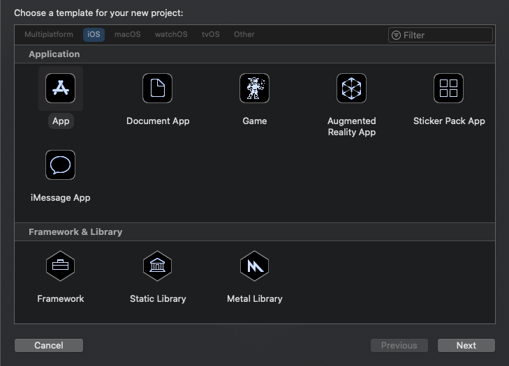

<!-- markdownlint-disable MD002 MD041 -->

首先创建一个新的 Swift 项目。

1. 打开 Xcode。 在 "**文件**" 菜单上，依次选择 "**新建**"、"**项目**"。
1. 选择 "**单个视图应用程序**" 模板，然后选择 "**下一步**"。

    

1. 将 "**产品名称**" `GraphTutorial`和 "要快速的**语言**" 设置为**Swift**。
1. 填写其余字段，然后选择 "**下一步**"。
1. 选择项目的位置并选择 "**创建**"。

## <a name="install-dependencies"></a>安装依赖项

在继续之前，请安装稍后将使用的一些其他依赖项。

- 适用于[iOS 的 Microsoft 身份验证库（MSAL）](https://github.com/AzureAD/microsoft-authentication-library-for-objc) ，用于向 Azure AD 进行身份验证。
- [Microsoft GRAPH SDK For 客观 C](https://github.com/microsoftgraph/msgraph-sdk-objc) ，用于调用 Microsoft graph。
- [Microsoft Graph 模型 SDK （针对目标 C](https://github.com/microsoftgraph/msgraph-sdk-objc-models) ）对于强类型的对象，表示 Microsoft Graph 资源，如用户或事件。

1. 退出 Xcode。
1. 打开 "终端" 并将目录更改为**GraphTutorial**项目的位置。
1. 运行以下命令以创建 Podfile。

    ```Shell
    pod init
    ```

1. 打开 Podfile，并在行的`use_frameworks!`后面添加以下行。

    ```Ruby
    pod 'MSAL', '~> 1.0.2'
    pod 'MSGraphClientSDK', ' ~> 1.0.0'
    pod 'MSGraphClientModels', '~> 1.3.0'
    ```

1. 保存 Podfile，然后运行以下命令来安装依赖项。

    ```Shell
    pod install
    ```

1. 命令完成后，在 Xcode 中打开新创建的**GraphTutorial graph-ios-swift-connect.xcworkspace** 。

## <a name="design-the-app"></a>设计应用程序

在本节中，您将为应用程序创建视图：登录页面、选项卡栏导航器、欢迎页面和日历页面。 您还将创建活动指示器覆盖。

### <a name="create-sign-in-page"></a>创建登录页

1. 展开 Xcode 中的 " **GraphTutorial** " 文件夹，然后选择**viewcontroller.m**。
1. 在**文件检查器**中，将文件的**名称**更改为`SignInViewController.swift`。

    

1. 打开**SignInViewController** ，并将其内容替换为以下代码。

    ```Swift
    import UIKit

    class SignInViewController: UIViewController {

        override func viewDidLoad() {
            super.viewDidLoad()
            // Do any additional setup after loading the view.
        }

        @IBAction func signIn() {
            self.performSegue(withIdentifier: "userSignedIn", sender: nil)
        }
    }
    ```

1. 打开 " **storyboard** " 文件。
1. 展开 "**查看控制器场景**"，然后选择 "**查看控制器**"。

    

1. 选择 "**标识" 检查器**，然后将 "**类**" 下拉列表更改为 " **SignInViewController**"。

    

1. 选择**库**，然后将**按钮**拖到 "**登录视图" 控制器**上。

    

1. 选择该按钮后，选择 "**属性" 检查器**， **** 并将按钮的标题`Sign In`更改为。

    

1. 选择 "**登录视图控制器**"，然后选择 "**连接检查器**"。
1. 在 "**接收的操作**" 下，将 "**登录**" 旁边的未填充圆圈拖到按钮上。 在弹出菜单上选择 "**向上触摸**"。

    

1. 在**编辑器**菜单上，选择 "**解决自动布局问题**"，然后**在 "登录视图控制器" 中选择 "在所有视图的**下方**添加缺少的约束**"。

### <a name="create-tab-bar"></a>创建选项卡栏

1. 选择**库**，然后将**选项卡栏控制器**拖到情节提要上。
1. 选择 "**登录视图控制器**"，然后选择 "**连接检查器**"。
1. 在 "已**触发 Segues**" 下，将 "**手动**" 旁边的未填充圆圈拖到情节提要上的**选项卡栏控制器**上。 在弹出菜单中选择 "**模式显示**"。

    

1. 选择您刚刚添加的 segue，然后选择 "**属性" 检查器**。 将 "**标识符**" 字段`userSignedIn`**设置为，** 并将 "**演示文稿**" 设置为全屏。

    

1. 选择 "**项目1场景**"，然后选择 "**连接检查器**"。
1. 在 "已**触发 Segues**" 下，将 "**手动**" 旁边的未填充圆圈拖到情节提要上的 "**登录视图控制器" 中**。 在弹出菜单中选择 "**模式显示**"。
1. 选择您刚刚添加的 segue，然后选择 "**属性" 检查器**。 将 "**标识符**" 字段`userSignedOut`**设置为，** 并将 "**演示文稿**" 设置为全屏。

### <a name="create-welcome-page"></a>创建欢迎页面

1. 选择 " **xcassets** " 文件。
1. 在**编辑器**菜单上，选择 "**添加资源**"，然后选择 "**新建图像集**"。
1. 选择新**图像**资产，并使用 "**属性" 检查器**将其**名称**设置为`DefaultUserPhoto`。
1. 添加您希望用作默认用户配置文件照片的任何图像。

    

1. 在名为`WelcomeViewController`的**GraphTutorial**文件夹中创建一个新的**Cocoa Touch 类**文件。 在字段的 "**子类**" 中选择 " **UIViewController** "。
1. 打开**WelcomeViewController** ，并将其内容替换为以下代码。

    ```Swift
    import UIKit

    class WelcomeViewController: UIViewController {

        @IBOutlet var userProfilePhoto: UIImageView!
        @IBOutlet var userDisplayName: UILabel!
        @IBOutlet var userEmail: UILabel!

        override func viewDidLoad() {
            super.viewDidLoad()

            // Do any additional setup after loading the view.

            // TEMPORARY
            self.userProfilePhoto.image = UIImage(imageLiteralResourceName: "DefaultUserPhoto")
            self.userDisplayName.text = "Default User"
            self.userEmail.text = "default@contoso.com"
        }

        @IBAction func signOut() {
            self.performSegue(withIdentifier: "userSignedOut", sender: nil)
        }
    }
    ```

1. 打开 "**情节提要**"。 选择 "**项目1场景**"，然后选择 "**标识检查器**"。 将 "**类**" 值更改为**WelcomeViewController**。
1. 使用**库**将以下项添加到**Item 1 场景**中。

    - 一个**图像视图**
    - 两个**标签**
    - 一个**按钮**

1. 选择 "图像" 视图，然后选择 "**大小" 检查器**。
1. 将 "**宽度**" 和 "**高度**" 设置为196。
1. 选择第二个标签，然后选择 "**属性" 检查器**。
1. 将**颜色**更改为**深灰色**的颜色，并将**字体**更改为**系统 12.0**。
1. 选择该按钮，然后选择 "**属性" 检查器**。
1. 将 "**标题**" `Sign Out`更改为。
1. 使用 "**连接检查器**" 进行以下连接。

    - 将**userDisplayName**插座链接到第一个标签。
    - 将**userEmail**插座链接到第二个标签。
    - 将**userProfilePhoto**插座链接到图像视图。
    - 将**signOut**接收的操作链接到按钮的**内部**。

1. 选择场景底部的 "选项卡栏" 项，然后选择 "**属性" 检查器**。 将 "**标题**" `Me`更改为。
1. 在**编辑器**菜单上，选择 "**解决自动布局问题**"，然后选择 **"欢迎视图控制器中的所有视图"** 下的 "**添加缺少约束**"。

完成后，欢迎场景应如下所示。


### <a name="create-calendar-page"></a>创建日历页

1. 在名为`CalendarViewController`的**GraphTutorial**文件夹中创建一个新的**Cocoa Touch 类**文件。 在字段的 "**子类**" 中选择 " **UIViewController** "。
1. 打开**CalendarViewController** ，并将其内容替换为以下代码。

    ```Swift
    import UIKit

    class CalendarViewController: UIViewController {

        @IBOutlet var calendarJSON: UITextView!

        override func viewDidLoad() {
            super.viewDidLoad()

            // Do any additional setup after loading the view.

            // TEMPORARY
            calendarJSON.text = "Calendar"
            calendarJSON.sizeToFit()
        }
    }
    ```

1. 打开 "**情节提要**"。 选择 "**项目2场景**"，然后选择 "**标识检查器**"。 将 "**类**" 值更改为**CalendarViewController**。
1. 使用**库**向**项目2场景**添加**文本视图**。
1. 选择您刚添加的文本视图。 在**编辑器**中，依次选择 "**嵌入入**" 和 "**滚动视图**"。
1. 使用 "**连接" 检查器**，将**calendarJSON**插座连接到文本视图。
1. 1. 选择场景底部的 "选项卡栏" 项，然后选择 "**属性" 检查器**。 将 "**标题**" `Calendar`更改为。
1. 在**编辑器**菜单上，选择 "**解决自动布局问题**"，然后选择 **"欢迎视图控制器中的所有视图"** 下的 "**添加缺少约束**"。

完成后，日历场景应如下所示。


### <a name="create-activity-indicator"></a>创建活动指示器

1. 在名为`SpinnerViewController`的**GraphTutorial**文件夹中创建一个新的**Cocoa Touch 类**文件。 在字段的 "**子类**" 中选择 " **UIViewController** "。
1. 打开**SpinnerViewController** ，并将其内容替换为以下代码。

    ```Swift
    import UIKit

    class SpinnerViewController: UIViewController {

        var spinner = UIActivityIndicatorView(style: .whiteLarge)

        override func loadView() {
            view = UIView()
            view.backgroundColor = UIColor(white: 0, alpha: 0.7)

            spinner.translatesAutoresizingMaskIntoConstraints = false
            spinner.startAnimating()
            view.addSubview(spinner)

            spinner.centerXAnchor.constraint(equalTo: view.centerXAnchor).isActive = true
            spinner.centerYAnchor.constraint(equalTo: view.centerYAnchor).isActive = true
        }

        public func start(container: UIViewController) {
            container.addChild(self)
            self.view.frame = container.view.frame
            container.view.addSubview(self.view)
            self.didMove(toParent: container)
        }

        public func stop() {
            self.willMove(toParent: nil)
            self.view.removeFromSuperview()
            self.removeFromParent()
        }
    }
    ```

## <a name="test-the-app"></a>测试应用程序

保存所做的更改并启动应用程序。 您应该能够使用 "**登录**" 和 "**注销**" 按钮和选项卡栏在屏幕之间移动。


