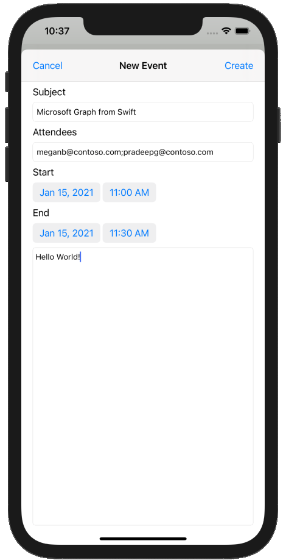

<!-- markdownlint-disable MD002 MD041 -->

在此部分中，您将添加在用户日历上创建事件的能力。In this section you will add the ability to create events on the user's calendar.

1. 打开 **GraphManager.swift** 并添加以下函数以在用户日历上创建新事件。Open **GraphManager.swift** and add the following function to create a new event on the user's calendar.

    :::code language="swift" source="../demo/GraphTutorial/GraphTutorial/GraphManager.swift" id="CreateEventSnippet":::

1. 在 **GraphTu一** l 文件夹中 **新建一** 个名为 Cocoa Touch 类的文件 `NewEventViewController` 。Create a new **Cocoa Touch Class** file in the **GraphTutorial** folder named `NewEventViewController`. 在 **字段的子类中选择 UIViewController。** Choose **UIViewController** in the **Subclass of** field.
1. 打开 **NewEventViewController.swift，** 并将其内容替换为以下内容。Open **NewEventViewController.swift** and replace its contents with the following.

    :::code language="swift" source="../demo/GraphTutorial/GraphTutorial/NewEventViewController.swift" id="NewEventViewControllerSnippet":::

1. 打开 **Main.storyboard**。Open **Main.storyboard**. 使用 **库** 将视图 **控制器拖动** 到情节提要上。Use the **Library** to drag a **View Controller** onto the storyboard.
1. 使用 **库**，将 **导航栏** 添加到视图控制器。Using the **Library**, add a **Navigation Bar** to the view controller.
1. 双击导航 **栏中** 的标题，并更新为 `New Event` 。Double-click the **Title** in the navigation bar and update it to `New Event`.
1. 使用 **库**，将 **栏按钮项** 添加到导航栏的左侧。Using the **Library**, add a **Bar Button Item** to the left-hand side of the navigation bar.
1. 选择新的栏按钮，然后选择 **属性检查器**。Select the new bar button, then select the **Attributes Inspector**. 将 **标题更改为** `Cancel` 。Change **Title** to `Cancel`.
1. 使用 **库**，将 **栏按钮项** 添加到导航栏的右侧。Using the **Library**, add a **Bar Button Item** to the right-hand side of the navigation bar.
1. 选择新的栏按钮，然后选择 **属性检查器**。Select the new bar button, then select the **Attributes Inspector**. 将 **标题** 更改为 `Create` 。Change **Title** to `Create`.
1. 选择视图控制器，然后选择 **标识检查器**。Select the view controller, then select the **Identity Inspector**. 将 **类** 更改为 **NewEventViewController**。Change **Class** to **NewEventViewController**.
1. 将以下控件从 **库** 添加到视图中。Add the following controls from the **Library** to the view.

    - 在导航 **栏** 下添加标签。Add a **Label** under the navigation bar. 将文本设置为 `Subject` 。Set its text to `Subject`.
    - 在标签 **下添加** 文本字段。Add a **Text Field** under the label. 将占位符 **属性** 设置为 `Subject` 。Set its **Placeholder** attribute to `Subject`.
    - 在文本 **字段** 下添加标签。Add a **Label** under the text field. 将文本设置为 `Attendees` 。Set its text to `Attendees`.
    - 在标签 **下添加** 文本字段。Add a **Text Field** under the label. 将占位符 **属性** 设置为 `Separate multiple entries with ;` 。Set its **Placeholder** attribute to `Separate multiple entries with ;`.
    - 在文本 **字段** 下添加标签。Add a **Label** under the text field. 将文本设置为 `Start` 。Set its text to `Start`.
    - 在标签 **下添加** 日期选取器。Add a **Date Picker** under the label. 将首选 **样式** 设置为 **"压缩**"，**将间隔** 设置为 **15 分钟**，将高度设置为 **35。**Set its **Preferred Style** to **Compact**, its **Interval** to **15 minutes**, and its height to **35**.
    - 在日期 **选取** 器下添加标签。Add a **Label** under the date picker. 将文本设置为 `End` 。Set its text to `End`.
    - 在标签 **下添加** 日期选取器。Add a **Date Picker** under the label. 将首选 **样式** 设置为 **"压缩**"，**将间隔** 设置为 **15 分钟**，将高度设置为 **35。**Set its **Preferred Style** to **Compact**, its **Interval** to **15 minutes**, and its height to **35**.
    - 在日期 **选取器** 下添加文本视图。Add a **Text View** under the date picker.

1. 选择 **"新建事件视图控制器** "，并使用 **连接检查** 器建立以下连接。Select the **New Event View Controller** and use the **Connection Inspector** to make the following connections.

    - 将 **取消** 接收的操作连接到"取消栏 **"** 按钮。Connect the **cancel** received action to the **Cancel** bar button.
    - 将 **createEvent** 接收的操作连接到 **"创建栏"** 按钮。Connect the **createEvent** received action to the **Create** bar button.
    - 将 **主题出口** 连接到第一个文本字段。Connect the **subject** outlet to the first text field.
    - 将 **与会者出口** 连接到第二个文本字段。Connect the **attendees** outlet to the second text field.
    - 将 **开始出口** 连接到第一个日期选取器。Connect the **start** outlet to the first date picker.
    - 将 **结束出口** 连接到第二个日期选取器。Connect the **end** outlet to the second date picker.
    - 将 **正文出口** 连接到文本视图。Connect the **body** outlet to the text view.

1. 添加以下约束。Add the following constraints.

    - **导航栏****Navigation Bar**
        - 安全区域前导空格，值：0Leading space to Safe Area, value: 0
        - 安全区域尾部空间，值：0Trailing space to Safe Area, value: 0
        - 安全区域的顶部空间，值：0Top space to Safe Area, value: 0
        - 高度，值：44Height, value: 44
    - **主题标签****Subject Label**
        - 视图边距前导空格，值：0Leading space to View margin, value: 0
        - 查看边距的尾部空间，值：0Trailing space to View margin, value: 0
        - 导航栏的顶部空间，值：20Top space to Navigation Bar, value: 20
    - **主题文本字段****Subject Text Field**
        - 视图边距前导空格，值：0Leading space to View margin, value: 0
        - 查看边距的尾部空间，值：0Trailing space to View margin, value: 0
        - 主题标签的上空间，值：StandardTop space to Subject Label, value: Standard
    - **与会者标签****Attendees Label**
        - 视图边距前导空格，值：0Leading space to View margin, value: 0
        - 查看边距的尾部空间，值：0Trailing space to View margin, value: 0
        - 主题文本字段的上空间，值：StandardTop space to Subject Text Field, value: Standard
    - **与会者文本字段****Attendees Text Field**
        - 视图边距前导空格，值：0Leading space to View margin, value: 0
        - 查看边距的尾部空间，值：0Trailing space to View margin, value: 0
        - 与会者标签的上空间，值：StandardTop space to Attendees Label, value: Standard
    - **开始标签****Start Label**
        - 视图边距前导空格，值：0Leading space to View margin, value: 0
        - 查看边距的尾部空间，值：0Trailing space to View margin, value: 0
        - 主题文本字段的上空间，值：StandardTop space to Subject Text Field, value: Standard
    - **开始日期选取器****Start Date Picker**
        - 视图边距前导空格，值：0Leading space to View margin, value: 0
        - 查看边距的尾部空间，值：0Trailing space to View margin, value: 0
        - 与会者标签的上空间，值：StandardTop space to Attendees Label, value: Standard
        - 高度，值：35Height, value: 35
    - **结束标签****End Label**
        - 视图边距前导空格，值：0Leading space to View margin, value: 0
        - 查看边距的尾部空间，值：0Trailing space to View margin, value: 0
        - 开始日期选取器的顶部空间，值：StandardTop space to Start Date Picker, value: Standard
    - **结束日期选取器****End Date Picker**
        - 视图边距前导空格，值：0Leading space to View margin, value: 0
        - 查看边距的尾部空间，值：0Trailing space to View margin, value: 0
        - 结束标签的上空间，值：StandardTop space to End Label, value: Standard
        - 高度：35Height: 35
    - **正文文本视图****Body Text View**
        - 视图边距前导空格，值：0Leading space to View margin, value: 0
        - 查看边距的尾部空间，值：0Trailing space to View margin, value: 0
        - 结束日期选取器的顶部空间，值：StandardTop space to End Date Picker, value: Standard
        - 查看边距的底部空间，值：0Bottom space to View margin, value: 0

    

1. 选择 **日历场景**，然后选择连接 **检查器**。Select the **Calendar Scene**, then select the **Connections Inspector**.
1. 在 **"触发的 Segues"** 下，将手动旁的未填充圆圈拖到情节提要上的"新建事件 **视图** 控制器"上。Under **Triggered Segues**, drag the unfilled circle next to **manual** onto the **New Event View Controller** on the storyboard. 在 **弹出菜单中** 选择"以模式方式显示"。Select **Present Modally** in the pop-up menu.
1. 选择刚添加的 segue，然后选择 **属性检查器**。Select the segue you just added, then select the **Attributes Inspector**. 将 **Identifier 字段** 设置为 `showEventForm` 。Set the **Identifier** field to `showEventForm`.
1. 将 **showNewEventForm** 接收的操作连接到 **+** 导航栏按钮。Connect the **showNewEventForm** received action to the **+** navigation bar button.
1. 保存更改并重新启动该应用。Save your changes and restart the app. 转到日历页面，然后点击 **+** 该按钮。Go to the calendar page and tap the **+** button. 填写表单并点击 **"创建** "创建新事件。Fill in the form and tap **Create** to create a new event.

    
